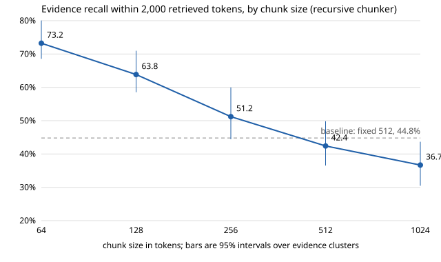

# Stage 3: Chunking

One variable changes in this stage: how each article is cut into chunks. The embedder, the search and the prompt stay as in the baseline.

## Concept

**A chunk is the unit of three things at once:** what gets one embedding vector, what gets ranked, and what is pasted into the prompt. Those three want different sizes.

| Force | Pulls towards | Why |
|---|---|---|
| Embedding precision | small chunks | One vector averages everything in the chunk. A 34-token evidence sentence is 7% of a 512-token chunk and 27% of a 128-token one. |
| Context for the generator | large chunks | A lone sentence loses what "he", "the company" or "that ruling" refers to. |
| Token budget | small chunks | 2,000 tokens hold 4 chunks of 512 or 20 of 128. More, smaller pieces reach more articles, which a multi-hop question needs. |
| Boundary damage | boundaries on sentences or paragraphs | A cut mid-sentence leaves two chunks that each hold half a fact. |

**Strategies.** Code: [chunking/](../../src/ragbasics/chunking/).

| Chunker | Rule | Cost |
|---|---|---|
| Fixed (baseline) | Cut every N tokens. | None. Cuts anywhere. |
| Sentence | Pack whole sentences up to N tokens. | Needs a sentence splitter, which errs on abbreviations and quotes. |
| Paragraph | Pack whole paragraphs up to N; split an oversize paragraph by sentence. | Uneven sizes. |
| Recursive | Split on the coarsest separator first (blank line, line, sentence, word). Pack the pieces that fit; split any piece that is still too big on the next separator. | The usual default. |
| Semantic | Embed every sentence, and cut where neighbouring sentences are least similar. | One extra embedding pass over every sentence. Chunk size is an outcome, not a setting. |
| Parent-child | Embed small children; return the larger parent that contains the child that matched. | Two sizes to choose. Several children collapse to one parent. |

**Overlap** repeats the end of one chunk at the start of the next, so a fact on a boundary is whole in at least one chunk. It costs index size, and it spends the prompt budget on text that is sent twice.

**Why chunkers are compared on a token budget.** Five chunks of 1,024 tokens hold eight times the text of five chunks of 128. Recall@5 therefore rises with chunk size for no reason a prompt would care about. Every row below is compared on recall and precision within the first 2,000 retrieved tokens.

## Options

| Decision | Options | Trade-off |
|---|---|---|
| Where a boundary may fall | any token; sentence end; paragraph end | Natural boundaries keep facts whole and make sizes uneven. |
| Chunk size | 64 to 1,024 tokens | Small: sharper vectors, more articles per prompt, less context per passage, more vectors to store. |
| Overlap | 0, 10%, 20% | Protects facts on a boundary; duplicates text. |
| How boundaries are found | rules; an embedding model | The model costs an extra pass and gives no control over size. |
| Unit searched and unit returned | the same; child searched, parent returned | Parent-child gives sharp vectors and full context, and returns fewer distinct passages per token. |

## What we chose

- **Shared machinery.** [chunking/units.py](../../src/ragbasics/chunking/units.py) holds the splitters (paragraph, line, sentence, word, token) and one packing function. Every splitter returns character spans that tile its input, so every chunk is a slice of the article and can be checked against the gold spans.
- **Sentence, paragraph and recursive** are three settings of one class in [chunking/recursive.py](../../src/ragbasics/chunking/recursive.py). They differ only in the list of separators.
- **Sentence splitting** is a rule: closing punctuation followed by whitespace, with a short list of abbreviations. It is wrong sometimes, and a wrong boundary only moves where a chunk may end.
- **Semantic** ([chunking/semantic.py](../../src/ragbasics/chunking/semantic.py)): each sentence is embedded with one neighbour on each side, cuts fall at the gaps above the article's 90th percentile of distance, and segments are capped at 128 tokens. Percentile 90 was chosen without looking at any retrieval score, because it gives chunks of the same average size as recursive at 128 (88 against 92 tokens). Sentence vectors are cached on disk.
- **Parent-child** ([chunking/parent_child.py](../../src/ragbasics/chunking/parent_child.py)) emits one chunk per child. `embed_text` is the child; `text`, `start_char` and `end_char` are the parent's.
- **Overlap** was measured on the fixed chunker at 512 tokens, so the baseline is the 0% point and nothing else differs. On the recursive chunker overlap repeats whole pieces only; with paragraphs of 37 tokens at the median, a 13- or 26-token overlap at size 128 would repeat almost nothing.
- **Configs:** [configs/stage03_chunking/](../../configs/stage03_chunking/), one file per row, each with its own index directory.

**How parent-child is scored.** The token-budget metric assumes a chunk's text is the slice of the article between its `start_char` and `end_char`. Parent-child keeps that true by returning the parent: the ranked list holds parents, in the order of their best child, each once. The pipeline searches four times deeper than asked (`overfetch: 4`) and drops repeats, so the list still has 50 entries. What is scored is the text that would reach the prompt. nDCG's count of relevant chunks also counts each parent once.

**Two rows added to the plan** once the first results were in: recursive at 64 tokens, because recall was still rising at the smallest planned size, and fixed at 128, to compare strategies at the size that did best.

**Paragraph is not a separate row.** On this corpus every line break is a blank line, so the paragraph and recursive chunkers produce identical chunks (checked at 512 tokens). One index covers both.

**Harness changes made first.**

- `rag report` now shows the paired difference from the baseline for recall and precision in 2,000 tokens. It showed it only for answer correctness.
- `rag ingest --estimate` prints the cost and stops, and prints the semantic chunker's sentence-embedding cost before anything is embedded.
- A retrieval-only run refuses to overwrite an answer-quality run with the same run id.
- Each index directory gets an `ingest.json` with chunk count, tokens, cost and time.

## Measured result

No predictions were written down for this stage.

441 development questions with gold evidence. "vs baseline" is the paired difference in percentage points with a 95% interval from redrawing evidence clusters. Regenerate with `python scripts/stage03_sweep.py`; the numbers are in [results/stage03_chunking.csv](../../results/stage03_chunking.csv).

| Run | Chunks | Mean tokens | Recall in 2,000 tok | vs baseline | Precision in 2,000 tok | Full support in 2,000 tok |
|---|---|---|---|---|---|---|
| baseline (fixed 512) | 3,036 | 459 | 44.8 | | 1.68 | 17.9 |
| sentence 512 | 3,157 | 442 | 44.4 | −0.4 (−2.7 to +1.6) | 1.71 | 18.1 |
| recursive 512 | 3,275 | 426 | 42.4 | −2.4 (−5.2 to −0.2) | 1.62 | 14.7 |
| recursive 1,024 | 1,748 | 798 | 36.7 | −8.1 (−13.2 to −4.1) | 1.40 | 11.6 |
| recursive 256 | 6,784 | 206 | 51.2 | +6.4 (+2.7 to +10.9) | 1.92 | 24.7 |
| recursive 128 | 15,149 | 92 | 63.8 | +19.0 (+14.7 to +22.7) | 2.49 | 36.5 |
| recursive 64 | 33,765 | 42 | 73.2 | +28.4 (+23.8 to +32.7) | 2.95 | 49.7 |
| fixed 128 | 11,208 | 124 | 60.9 | +16.1 (+12.3 to +19.3) | 2.18 | 33.3 |
| fixed 512, 10% overlap | 3,260 | 469 | 42.0 | −2.8 (−7.3 to +0.7) | 1.61 | 15.9 |
| fixed 512, 20% overlap | 3,549 | 477 | 38.8 | −6.0 (−10.1 to −2.6) | 1.48 | 13.2 |
| semantic, cap 128 | 15,868 | 88 | 63.4 | +18.6 (+14.5 to +22.4) | 2.42 | 37.4 |
| parent-child 128 → 512 | 15,662 | 89 | 45.7 | +0.9 (−3.2 to +5.0) | 1.78 | 18.1 |
| parent-child 128 → 256 | 16,147 | 86 | 55.0 | +10.2 (+5.3 to +14.4) | 2.11 | 28.1 |

"Full support in 2,000 tok" is the share of questions with every gold sentence inside the budget. For parent-child, "chunks" and "mean tokens" describe the children that are embedded.

### Finding 1: size decides, and smaller is better at every step

Each halving of the chunk size raises recall within 2,000 tokens, from 36.7% at 1,024 tokens to 73.2% at 64. Every step's interval against the baseline excludes 0. The mechanism is visible in what fills the budget:

| Recursive size | Chunks inside 2,000 tokens | Distinct articles among them |
|---|---|---|
| 1,024 | 3.0 | 2.4 |
| 512 | 5.1 | 3.2 |
| 256 | 9.8 | 4.9 |
| 128 | 20.7 | 8.3 |
| 64 | 43.8 | 13.7 |

Every question here needs sentences from at least two articles. A budget spent on three large chunks cannot reach many articles; the same budget spent on twenty small ones can.

The gain holds for each question type. Recall in 2,000 tokens, baseline against recursive 128: comparison 51.1 → 72.4, inference 28.7 → 52.9, temporal 47.7 → 58.7.

### Finding 2: recall@5 says the opposite

| Run | Recall@5 | Recall in 2,000 tok |
|---|---|---|
| recursive 1,024 | 53.6 | 36.7 |
| baseline | 48.2 | 44.8 |
| recursive 128 | 35.2 | 63.8 |

Ranked by recall@5, the largest chunks win and the 128-token chunker loses 13 points to the baseline. Five chunks of 128 tokens are about 500 tokens of text, against 2,400 for the baseline. A chunk-size choice made on recall@k would have picked the worst row in the table.

It also means `top_k: 5` cannot stay fixed when the chunk size changes. The answer-quality run below uses 25 chunks of 128 tokens, which is the same amount of text as the baseline's 5 of 512.

### Finding 3: strategy matters little, and not consistently

- At 512 tokens, recursive is 2.4 points below fixed (−5.2 to −0.2) and 2.0 below sentence (−4.1 to −0.3).
- At 128 tokens the order reverses: recursive is 2.9 points above fixed (−0.6 to +6.4), with precision +0.3 (+0.1 to +0.5).
- Fixed cuts 19 of 387 gold sentences at 512 tokens and 97 at 128. Recursive cuts none at either size. That did not show up as a recall difference at 512.

The differences are 3 points or less with intervals that touch or nearly touch 0, and they change sign with size. I have no measured explanation for recursive losing at 512. Against a 19-point effect from size, strategy is a second-order choice on this corpus. The articles are clean text with short paragraphs, which is the easy case for a fixed cut.

### Finding 4: overlap hurts here

10% overlap costs 2.8 points (−7.3 to +0.7) and 20% costs 6.0 (−10.1 to −2.6), for 10% and 22% more tokens to embed.

Repeated text inside the budget explains only part of it: at 20% overlap, 94.8% of the text in the budget is unique, so about 5% is spent twice. The rest is not explained by this experiment. What can be said is that overlap's intended benefit had little room to show: the baseline cuts only 19 of 387 gold sentences, and a cut sentence still counts as found when either half is retrieved.

### Finding 5: semantic chunking matches recursive at the same size, at four times the indexing cost

Semantic against recursive 128: −0.5 points (−3.6 to +2.7) on recall and −0.1 (−0.2 to +0.1) on precision. The two cannot be told apart.

| | Recursive 128 | Semantic, cap 128 |
|---|---|---|
| Tokens embedded at index time | 1.40M | 5.58M (4.18M for sentences, 1.40M for chunks) |
| Embedding cost | $0.028 | $0.112 |
| Chunking time | 0.4 s | 226 s for the sentence vectors |

This agrees with the 2025–26 studies in the research notes. One configuration was tested, so the claim is limited to it.

### Finding 6: parent-child ranks better than flat chunks of the parent's size, and loses to flat chunks of the child's size

| Comparison | Recall in 2,000 tok |
|---|---|
| parent-child 128 → 512 against recursive 512 | +3.3 (−0.8 to +7.6) |
| parent-child 128 → 256 against recursive 256 | +3.8 (+0.5 to +6.6) |
| parent-child 128 → 256 against recursive 128 | −8.8 (−11.7 to −6.1) |

Ranking parents by their best child is better than ranking them by their own vector, by 3 to 4 points. But the budget is then spent on parents, so fewer distinct passages fit, and the flat 128-token index reaches more evidence. On a token-budget metric parent-child sits between its two sizes. Its case rests on the generator needing the surrounding text, which this metric does not measure.

### Finding 7: what this metric cannot decide

Recall in 2,000 tokens counts a gold sentence as found when any part of it is in the budget. It does not ask whether the passage around it is enough to answer from. It will keep rewarding smaller chunks down to single sentences, and 64 tokens is already one or two sentences (the median evidence sentence is 34 tokens).

So the retrieval table can rank chunkers of similar size, and it shows where the evidence becomes reachable. Whether the generator can use fifty two-sentence fragments is an answer-quality question, and Stage 2 showed that answer correctness is a weak instrument on this subset.

### Answer quality for the winner

One run: recursive 128 with 25 chunks in the prompt ([recursive-128-k25.yaml](../../configs/stage03_chunking/recursive-128-k25.yaml)), about 2,480 tokens of passages against the baseline's 2,380. 150 questions, $1.47.

| | Baseline | Recursive 128, k=25 | Paired difference |
|---|---|---|---|
| Correct | 51.3 (42–60) | 56.0 (47–64) | +4.7 (−1.7 to +11.4) |
| Correct, answerable | 44.7 | 50.0 | +5.3 (−2.3 to +13.4) |
| False abstentions | 52.3 | 47.0 | −5.3 (−14.1 to +3.1) |
| Abstains on null | 100 | 100 | 0 |
| Comparison | 31.7 | 33.3 | +1.6 (−12.5 to +16.4) |
| Inference | 84.4 | 100 | +15.6 (+5.6 to +38.9) |
| Temporal | 32.4 | 35.1 | +2.7 (−9.1 to +15.8) |

Read against the Stage 2 noise:

- **Overall correctness is up 4.7 points and the interval includes 0.** 31 of 150 answers changed between right and wrong (19 gained, 12 lost), against 6 of 150 between two identical baseline runs. So the answers did change more than asking twice changes them; the net gain is not established.
- **The only type that moved is inference,** and Stage 2 showed the generator answers 97% of those with no passages at all. That gain is not evidence about retrieval.
- **The guesser scores 52.7.** This is the first row above it, by an amount inside its interval.

The more useful reading is what happened when the evidence did reach the prompt. Of the 132 answerable questions:

| | Every gold sentence in the prompt | Of those: right | Of those: declined | Of those: wrong |
|---|---|---|---|---|
| Baseline | 22 | 15 | 6 | 1 |
| Recursive 128, k=25 | 50 | 25 | 25 | 0 |

Chunking more than doubled the questions whose full evidence is in the prompt, from 22 to 50. The generator then declined half of them. That is Stage 2's second finding again: comparison and temporal questions ask about named sources and dates, the passages carry neither, and the prompt says to decline when the passages are not enough. Better retrieval alone does not turn into answers here; the remaining loss is in the prompt (Stage 8) and the abstention rule (Stage 9).

The faithfulness column (68.6 against 81.0) is not read: that judge is still unvalidated.

### New best config

**Recursive splitting at 128 tokens, no overlap, 25 chunks in the prompt:** [configs/stage03_chunking/recursive-128-k25.yaml](../../configs/stage03_chunking/recursive-128-k25.yaml). Later stages change one thing against this config and still report against the Stage 1 baseline.

- Chosen on retrieval: +19.0 points of recall in 2,000 tokens (+14.7 to +22.7), with answer correctness no worse.
- 64 tokens scores another 9.4 points higher on retrieval (+5.5 to +13.0) and was not taken: its chunks are one or two sentences, a prompt holds about fifty of them, and it has no answer-quality run. It is the open candidate if Stage 8 shows the generator copes with many short passages.
- `top_k: 25` is a placeholder that keeps the amount of text equal to the baseline's. Stage 8 chooses the number of chunks properly.

**Open items carried forward:** human labels for the judge (before Stage 8), a gold-evidence row with source and date headers (with Stage 8), and the 64-token candidate (Stage 8).

### Index cost and size

| Run | Vectors | Index on disk | Build time |
|---|---|---|---|
| baseline | 3,036 | 25 MB | |
| recursive 512 | 3,275 | 27 MB | 75 s |
| recursive 256 | 6,784 | 49 MB | 66 s |
| recursive 128 | 15,149 | 102 MB | 92 s |
| recursive 64 | 33,765 | 219 MB | 210 s |
| parent-child 128 → 512 | 15,662 | 137 MB | 96 s |

- Embedding cost does not depend on chunk size: the same 1.39M tokens are embedded, about $0.028. Vector count and disk size do.
- Build time is almost all waiting on the embedding API, 100 chunks per request, one request at a time. Chunking itself takes under a second for every rule-based chunker.
- Exact search takes 0.3 ms over the baseline's 3,036 vectors and 4.6 ms over 33,765.

### Framework equivalent

[framework_equivalents/recursive_splitter.py](../../framework_equivalents/recursive_splitter.py) configures LangChain's `RecursiveCharacterTextSplitter` (1.1.3) to follow the same rule: token lengths, the same separators, separator kept at the end of a piece. `langchain-text-splitters` installs on Python 3.14 next to the project's dependencies, in the `frameworks` extra.

- `test_recursive_chunker_matches_langchain` checks identical chunks on a sample at three sizes and two overlaps.
- On the corpus, with whitespace-only chunks ignored, the two give identical chunks for 609 of 609 articles at 512 tokens, 608 at 256 and 575 at 128. Every difference is one rule: LangChain splits a piece again when it is exactly the chunk size.
- What LangChain does not give: character offsets. It returns strings, and its `add_start_index` option finds the start by searching for the chunk's text. It also has no sentence level unless you supply a regex.

### Cost

Stage 3 spent $1.90, taking the project to $5.13 of $40. The answer-quality run was $1.47. The retrieval sweep spent $0.43: twelve index builds at about $0.03 each, $0.08 for the semantic chunker's sentence vectors, and under a cent for query embeddings. That is 6 cents above the estimate given before the sweep, because each sentence is embedded together with its two neighbours, which triples the tokens.

## When you would choose differently in production

- **Start with recursive splitting and tune the size on your own questions.** Size was worth 19 points here and strategy 3. The right size depends on how many separate places an answer draws from; single-fact lookups in long manuals behave differently from multi-article questions.
- **Tune size and the number of chunks together.** A size chosen at a fixed k is chosen on a different amount of text each time.
- **Use structure when the documents have it.** Headings, tables, code blocks and list items are boundaries a token count cannot see. This corpus has none of them; Stage 10 does.
- **Small chunks cost storage and latency.** 64-token chunks are eleven times the vectors of 512-token ones. That is irrelevant at 34,000 vectors and a real bill at 100 million.
- **Small chunks need their context restored somewhere:** a parent or a window of neighbours at prompt time, source and date headers, or a context line added before embedding (advanced stage A1).
- **Use overlap when facts straddle boundaries and you cannot split on structure,** for example transcripts with no punctuation. Measure it; it is not free.
- **Semantic chunking is worth testing on documents that change topic without any formatting,** such as transcripts. On formatted prose it paid nothing here.

## Questions you should now be able to answer

1. Why do small chunks retrieve better and answer worse?
2. Why does recall@5 pick the wrong chunk size?
3. What does overlap cost?
4. When is semantic chunking worth its price?
5. What does parent-child chunking change, and what does it leave the same?
6. Why does parent-child lose to flat small chunks on a token-budget metric?

Short answers

1. A small chunk's vector is about one thing, so it matches a specific question closely, and more of them fit in a prompt. But a fragment can lose the subject, source or date the answer depends on.
2. Five chunks is a different amount of text at each size. Large chunks win at a fixed k because they bring more text, not because they rank better. At equal text, the 128-token index found 19 points more evidence than the 512-token one.
3. More tokens to embed and store, and prompt space spent on text sent twice. Here it also lowered recall, by 6 points at 20%.
4. When topic changes are not marked by any formatting. On this corpus it matched recursive splitting at four times the embedding cost.
5. It changes what is embedded (the child) and keeps what is returned (the parent). Ranking improves over embedding the parent directly; the prompt still receives parent-sized passages.
6. Each hit spends a parent's worth of the budget, so fewer distinct passages fit than with flat chunks of the child's size.

