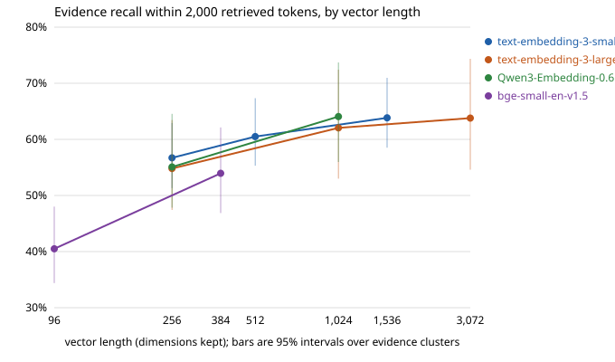

# Stage 4: Embedding models

One variable changes in this stage: the model that turns text into vectors. The chunks are the Stage 3 winner's (recursive, 128 tokens), and the search and the prompt stay as they were.

## Concept

**What an embedding model is asked to do.** Place a question near the passages that answer it. A question and its answer are not paraphrases of each other, so this is a harder job than placing similar sentences together, and models differ in how they were trained for it.

**What separates models in practice.**

| Property | What it is | What it decides |
|---|---|---|
| Dimensions | Length of the vector | Index size and search time, in proportion. |
| Context length | Most tokens the model reads per input | Longer inputs are cut without an error. |
| Query and document prefixes | Text put in front of the input before it is embedded | Whether the model can tell a question from a passage. |
| Truncatable dimensions | Training that puts most of the meaning in the leading dimensions (Matryoshka training) | How much accuracy a shorter vector keeps. |
| Cost and speed | API price per token, or compute on your own machine | The bill, and how long a re-index takes. |
| Licence and location | Open weights, restricted weights, or a hosted API | Whether you may use it, and whether your documents leave your machine. |

**Prefixes.** Some models were trained with an instruction in front of the query only (Qwen3, bge-small), some with one on both sides (EmbeddingGemma), and some with none (OpenAI, BGE-M3). The model was trained to expect the prefix, so leaving it out, or putting it on the wrong side, lowers accuracy and raises no error. That is why the embedder interface now takes a `kind`: the pipeline says "query" or "document" and each embedder applies what its model needs.

**Truncation.** Keeping the first 256 numbers of a 1,536-number vector makes the index six times smaller. Two rules:

- The model must have been trained for it, or the leading dimensions are no more important than the rest.
- The shortened vector must be scaled back to length 1. The first 256 numbers of a unit vector have a length below 1 that differs from vector to vector, so a dot product between them is no longer a cosine. `test_without_rescaling_a_truncated_dot_product_is_not_a_cosine` shows it on two vectors.

**Why a leaderboard rank does not transfer.** Public benchmarks overlap with what the models were trained on, and their text and question styles are not yours. The research notes cite the benchmark maintainers' own statement of this. So this stage ranks the models on our 441 questions.

## Options

| Model | Released | Dimensions | Reads up to | Prefix | Truncatable | Price per million tokens | Licence |
|---|---|---|---|---|---|---|---|
| `text-embedding-3-small` | 2024 | 1,536 | 8,191 tokens | none | yes | $0.02 | hosted API |
| `text-embedding-3-large` | 2024 | 3,072 | 8,191 tokens | none | yes | $0.13 | hosted API |
| `Qwen/Qwen3-Embedding-0.6B` | 2025 | 1,024 | 32,768 tokens | query only | yes | free, local | Apache-2.0 |
| `BAAI/bge-small-en-v1.5` | 2023 | 384 | 512 tokens | query only | no | free, local | MIT |
| `BAAI/bge-m3` | 2024 | 1,024 | 8,192 tokens | none | no | free, local | MIT |
| `google/embeddinggemma-300m` | 2025 | 768 | 2,048 tokens | query and document | yes | free, local | Gemma terms, gated |

## What we chose

- **Models run:** the first four rows. BGE-M3 (2.3 GB) and EmbeddingGemma (1.2 GB, and it needs the Gemma terms accepted on Hugging Face) were left out to keep downloads and manual steps small. Adding either is one config file.
- **Query and document.** `embed(texts, kind)` in [embedding/base.py](../../src/ragbasics/embedding/base.py). The pipeline embeds chunks as documents and the question as a query.
- **Local embedder:** [embedding/local.py](../../src/ragbasics/embedding/local.py). sentence-transformers loads the weights and runs the model. The prefix is a plain string in the config file, put in front of the text by this code, so it can be read and switched off. For both models the result is identical to passing the same prompt to the library (largest difference 0.0).
- **Model revisions are pinned** in each config, as the dataset revision is.
- **Truncation:** one function, `truncate`, cuts and re-normalises. For the OpenAI models it is done here and not through the API's `dimensions` parameter, which does the same thing; one paid call then serves every length.
- **Embedding cache:** [embedding/cache.py](../../src/ragbasics/embedding/cache.py), a SQLite file keyed by model, prefix and text, holding full-size vectors. It is set per config with `embedding_cache` and is not part of what an index depends on.
  - A repeated evaluation is now byte-identical per question. Before the cache, the API returned slightly different vectors for the same question on different days.
  - The truncated and no-prefix indexes were built from it in under a second each. `scripts/seed_embedding_cache.py` copied the vectors of the existing Stage 3 index into it, so `text-embedding-3-small` was not paid for again.
- **Dependencies:** PyTorch 2.14 and sentence-transformers 6.1 are in a `local` extra (`make setup-local`). They install on Python 3.14 and use the M4's GPU. They are imported on first use, so the test suite and CI run without them. transformers needs `huggingface_hub` below 2, which moved that package from 2.1.1 to 1.33.0.
- **Configs:** [configs/stage04_embedding/](../../configs/stage04_embedding/), one file per row, each with its own index directory.

**Harness changes made first.**

- `rag report` has a "recall in 2,000 tok vs best so far" column next to "vs baseline". The best run is `BEST_RUN` in [eval/report.py](../../src/ragbasics/eval/report.py).
- `rag ingest --estimate` counts only the texts that have no cached vector.

**What is comparable in this stage.** Every row uses the same 15,149 chunks, so recall@k, MRR and nDCG@10 are fair between rows here, which they were not in Stage 3. The token budget is still counted in `cl100k` tokens for every model, so each is scored on the same text whatever its own tokenizer is. No chunk exceeds any model's limit: the longest is 164 tokens in the two local models' tokenizers.

## Measured result

No predictions were written down for this stage.

441 development questions with gold evidence. Differences are paired, in percentage points, with a 95% interval from redrawing evidence clusters. "Best so far" is recursive 128 with `text-embedding-3-small`. Regenerate with `python scripts/stage04_sweep.py`; the numbers are in [results/stage04_embedding.csv](../../results/stage04_embedding.csv).

### Models at full size

| Model | Dimensions | Recall in 2,000 tok | vs best so far | vs baseline | nDCG@10 | nDCG@10 vs best so far | Recall@50 |
|---|---|---|---|---|---|---|---|
| text-embedding-3-small (best so far) | 1,536 | 63.8 | | +19.0 (+14.7 to +22.7) | 37.4 | | 80.8 |
| text-embedding-3-large | 3,072 | 63.8 | 0.0 (−4.6 to +4.6) | +19.0 (+14.4 to +24.6) | 40.8 | +3.4 (+0.8 to +6.5) | 78.6 |
| Qwen3-Embedding-0.6B | 1,024 | 64.1 | +0.2 (−3.3 to +4.5) | +19.3 (+15.5 to +23.5) | 42.1 | +4.7 (+2.0 to +8.2) | 78.8 |
| bge-small-en-v1.5 | 384 | 53.9 | −9.9 (−12.9 to −6.5) | +9.1 (+5.1 to +13.0) | 33.0 | −4.4 (−7.1 to −1.7) | 69.5 |

Precision in 2,000 tokens is 2.49, 2.44, 2.46 and 2.06 in the same order. Recall@50 is the share of gold sentences anywhere in the 50 retrieved chunks.

### Finding 1: three models tie on how much evidence they find

On recall within 2,000 tokens, the larger OpenAI model and Qwen3 are within 0.2 points of the small OpenAI model, with intervals of about ±4.5. Six and a half times the price, or twice the dimensions, bought no more evidence in the prompt.

Deeper in the list the small model is, if anything, ahead: recall@50 is 80.8 against 78.6 and 78.8 (−2.2, −7.0 to +2.3; −2.0, −5.3 to +2.3).

### Finding 2: the two newer models order the top of the list better

| Against best so far | text-embedding-3-large | Qwen3-Embedding-0.6B |
|---|---|---|
| Recall@5 | +3.5 (+0.7 to +6.7) | +6.9 (+3.2 to +11.6) |
| MRR@10 | +4.1 (−1.1 to +8.7) | +6.7 (+1.6 to +11.9) |
| nDCG@10 | +3.4 (+0.8 to +6.5) | +4.7 (+2.0 to +8.2) |
| Every gold sentence in the top 10 | +5.0 (+1.7 to +9.6) | +4.3 (+0.8 to +8.6) |
| Every gold sentence in 2,000 tokens | +5.2 (+0.7 to +10.2) | +4.3 (−0.5 to +9.9) |

So the models find the same amount of evidence within about twenty chunks and differ in where they put it. The gain is at the top: five chunks instead of twenty would show it, twenty do not.

Qwen3 against the larger OpenAI model: +0.3 on recall in 2,000 tokens (−4.1 to +4.2) and +1.3 on nDCG@10 (−2.1 to +5.3). The two cannot be told apart.

### Finding 3: the tie hides a split by question type

Recall in 2,000 tokens against the best so far:

| | Comparison (211) | Inference (105) | Temporal (125) |
|---|---|---|---|
| text-embedding-3-large | +1.6 (−2.7 to +6.4) | −5.4 (−12.8 to +4.2) | +1.7 (−2.4 to +6.6) |
| Qwen3-Embedding-0.6B | +2.4 (−1.7 to +7.2) | −6.0 (−11.7 to −0.3) | +1.9 (−4.8 to +10.2) |

Both newer models lose about 6 points on inference questions and gain about 2 on the other two types. Only Qwen3's inference loss has an interval that excludes 0, and narrowly. I have no measured explanation for it. It is a reason not to read the overall tie as "the models behave the same".

### Finding 4: the 2023 small model is 10 points behind

bge-small finds 53.9% of the evidence against 63.8%, and 69.5% against 80.8% at depth 50. It still beats the Stage 1 baseline by 9.1 points, because it runs on 128-token chunks: the Stage 3 chunking change was worth more than the gap between this model and the best one here.

### Finding 5: truncation costs, including on models trained for it

Each row against the same model at full size.

| Model | Kept | Share of the vector | Recall in 2,000 tok | vs full size | Index |
|---|---|---|---|---|---|
| text-embedding-3-large | 1,024 of 3,072 | 1/3 | 62.1 | −1.7 (−3.0 to −0.6) | 62 MB, was 186 |
| text-embedding-3-small | 512 of 1,536 | 1/3 | 60.5 | −3.3 (−5.5 to −1.7) | 31 MB, was 93 |
| Qwen3-Embedding-0.6B | 256 of 1,024 | 1/4 | 55.1 | −9.0 (−11.8 to −6.4) | 16 MB, was 62 |
| bge-small-en-v1.5 | 96 of 384 | 1/4 | 40.5 | −13.5 (−17.9 to −9.6) | 6 MB, was 23 |
| text-embedding-3-small | 256 of 1,536 | 1/6 | 56.7 | −7.1 (−10.7 to −4.4) | 16 MB, was 93 |
| text-embedding-3-large | 256 of 3,072 | 1/12 | 54.8 | −9.0 (−13.2 to −5.9) | 16 MB, was 186 |

- **Keeping a third costs 2 to 3 points.** Every interval excludes 0, so the loss is real and small.
- **At 256 dimensions the three truncatable models land together,** at 55 to 57%. Their differences from each other have intervals that include 0. At that length the model you started from stops mattering here, and all three are level with bge-small at its full 384 (53.9).
- **Training for truncation helps, by less than its reputation.** At a quarter of the vector, Qwen3 loses 9.0 points and bge-small, which was not trained for it, loses 13.5.
- **Search time is not a reason to truncate at this size.** Exact search over 15,149 vectors takes 3.6 ms at 3,072 dimensions and 0.9 ms at 256. Embedding the question takes 50 to 200 ms.

### Finding 6: the query prefix is worth 2 to 3 points

| Model | With prefix | Without | Recall in 2,000 tok | nDCG@10 |
|---|---|---|---|---|
| Qwen3-Embedding-0.6B | 64.1 | 61.0 | −3.1 (−5.6 to +0.1) | −2.2 (−3.7 to −0.7) |
| bge-small-en-v1.5 | 53.9 | 51.5 | −2.5 (−5.0 to −0.6) | −2.0 (−3.2 to −1.1) |

Leaving the instruction off the query loses 2 to 3 points with no error or warning. The loss is smaller than a wrong model choice and about the size of truncating to a third. It is the kind of mistake that survives for months because nothing breaks.

### Cost, speed and size

| Model | Price per million tokens | Index build | Chunks per second | Index on disk | Search | Embedding one question |
|---|---|---|---|---|---|---|
| text-embedding-3-small | $0.02 | 92 s, $0.028 | 164 (API) | 93 MB | 2.1 ms | 205 ms |
| text-embedding-3-large | $0.13 | 129 s, $0.180 | 117 (API) | 186 MB | 3.6 ms | 200 ms |
| Qwen3-Embedding-0.6B | free | 819 s | 20 | 62 MB | 1.8 ms | 49 ms |
| bge-small-en-v1.5 | free | 54 s | 382 | 23 MB | 1.1 ms | 8 ms |

- The two local build times include downloading and loading the model. "Chunks per second" for them is measured afterwards on 1,000 chunks, on the M4's GPU; at those rates the corpus takes about 750 s for Qwen3 and 40 s for bge-small. For the API models the rate is chunk count over build time, one request of 100 chunks at a time.
- Qwen3 is the slowest to index by a factor of six to nine and the fastest good model at query time, because a local call has no network round trip.
- The API times are latency, not compute, and would shrink with parallel requests. The local times are compute and would not.
- Qwen3's raw vectors have lengths between 0.997 and 1.003 on this machine, and bge-small's are 1 to seven decimal places. The store normalises both.

### The embedder chosen

**`text-embedding-3-small` stays.** The best config is unchanged: [configs/stage03_chunking/recursive-128-k25.yaml](../../configs/stage03_chunking/recursive-128-k25.yaml).

- The metric this project decides retrieval on, recall within 2,000 tokens, did not move for either challenger: 0.0 and +0.2, with intervals of about ±4.5. A new best config needs an interval that excludes 0.
- `text-embedding-3-large` costs 6.5 times as much and doubles the index for a better order in the top 10 and nothing more in the prompt.
- Qwen3 is the stronger challenger: free, local, a third smaller on disk, and +4.7 on nDCG@10. Against it: indexing takes about 12 minutes instead of 90 seconds, it loses 6 points on inference questions, and its gain is in the order of the top few chunks, which is exactly what the Stage 6 reranker changes. What a reranker needs from the first stage is evidence somewhere in the candidates, and at depth 50 the small OpenAI model is level or slightly ahead.
- No answer-quality run was made. Stage 3 showed answer correctness cannot resolve a retrieval difference of this size, and the prompt holds about twenty chunks, where the three models tie.

**Qwen3 is the open candidate.** If Stage 8 settles on a prompt of five to ten chunks with no reranker, its better ordering becomes the thing that matters and it should be tested again.

**Open items carried forward:** human labels for the judge (before Stage 8), a gold-evidence row with source and date headers (with Stage 8), the 64-token chunk candidate (Stage 8), and Qwen3 as the embedder candidate (after Stages 6 and 8).

### Cost

Stage 4 spent $0.19, taking the project to $5.32 of $40: $0.18 for one `text-embedding-3-large` index and under a cent for query embeddings. The estimate given before the sweep was $0.20.

## When you would choose differently in production

- **Test two or three candidates on your own questions before choosing.** Here the leaderboard order (large above small) did not show up on the metric that fills the prompt.
- **Choose a local model when documents may not leave your machines,** or when the volume makes API cost matter. At 1.4M tokens the API bill is 3 cents; at 10 billion it is $200 for the small model and $1,300 for the large one, each time you re-index.
- **Budget for re-indexing.** Changing the model means embedding everything again. A local model at 20 chunks per second on a laptop is 12 minutes for this corpus and weeks for 100 million chunks, which is a GPU decision.
- **Truncate when the index is what costs you:** hundreds of millions of vectors in memory. Keeping a third cost 2 to 3 points here. A common pattern is to search short vectors and re-score the top results with full ones (Stage 11 covers the quantized version of this).
- **A hosted model can be retired or changed.** Keep the canonical text, pin the model id, and record it with the index. For open weights, pin the revision.
- **Multilingual or long-document corpora change the ranking.** bge-small is English-only and reads 512 tokens; neither limit mattered on 128-token English chunks.
- **Write the prefix down where it can be seen,** and test with and without it once. A library default that silently applies, or silently does not, is the usual cause of a model performing below its reputation.

## Questions you should now be able to answer

1. Why does a leaderboard rank not transfer to your data?
2. What do you lose by truncating to 256 dimensions?
3. Why must a truncated vector be scaled back to length 1?
4. Why do some models need an instruction on the query only?
5. Why were recall@k and nDCG fair to compare in this stage and not in Stage 3?
6. Three models tied on recall in 2,000 tokens and differed on nDCG@10. What does that say about them?
7. What does the embedding cache key have to include?

Short answers

1. Benchmarks overlap with the models' training data and use other text and question styles. Here the larger OpenAI model found no more evidence than the smaller one within the prompt budget.
2. On this corpus 7 to 9 points of recall in 2,000 tokens for the models trained to be truncated, in exchange for an index 4 to 12 times smaller. Keeping a third of the vector cost 2 to 3 points.
3. The leading part of each unit vector has its own length below 1, so an unscaled dot product mixes direction with how much of each vector was kept. Scaling makes it a cosine again.
4. A question and its answer passage are different kinds of text. These models were trained with the instruction marking which one is the question; passages are embedded plain, so the index does not depend on the instruction.
5. Every model embedded the same chunks, so five chunks are the same amount of text for each. In Stage 3 the chunk size changed, so they were not.
6. They find the same evidence within about twenty chunks and order it differently near the top. Which matters depends on how many chunks reach the prompt and whether a reranker reorders them first.
7. The model and its revision, anything put in front of the text (so query and document vectors stay apart when they differ), and the text. Not the truncated length: the cache holds full vectors.

