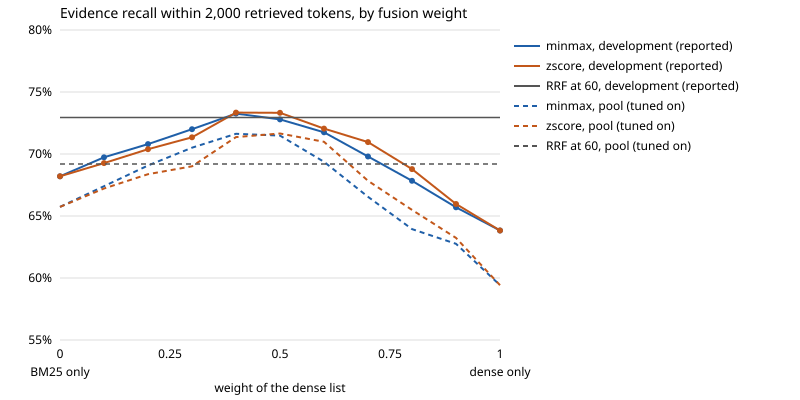

# Stage 5: Sparse and hybrid retrieval

One variable changes in this stage: how chunks are ranked for a question. The chunks are the Stage 3 winner's (recursive, 128 tokens), the embedder is the Stage 4 choice (`text-embedding-3-small`), and the prompt stays as it was.

## Concept

**Sparse retrieval scores a chunk by the question's words it contains.** "Sparse" because a chunk is described by the few terms it holds out of a vocabulary of tens of thousands, where an embedding has a number in every dimension. The standard scoring formula is BM25. For each term of the question it multiplies two parts and adds the results up. Code: [index/bm25.py](../../src/ragbasics/index/bm25.py).

| Part | Formula | What it does |
|---|---|---|
| Rarity (IDF) | `ln(1 + (N − df + 0.5) / (df + 0.5))` | `df` is how many of the `N` chunks hold the term. A term in 20 chunks counts for far more than one in 5,000. |
| Term frequency | `tf / (tf + k1 · (1 − b + b · length / average length))` | Grows with the term's count `tf` in the chunk and flattens towards 1. |

- **`k1` sets how fast repetition stops paying.** At 0 only presence counts. At 1.2, the usual default, a second occurrence adds about 40% and a tenth adds almost nothing.
- **`b` corrects for length.** A long chunk has more chances to contain any word. At 1 its counts are scaled down in full proportion to its length; at 0 length is ignored.
- **The inverted index** is what makes this fast: a map from each term to the chunks that contain it, with the count in each. A question touches only the lists of its own terms.

**Tokenisation decides what "the same word" means.** Code: [retrieval/tokenize.py](../../src/ragbasics/retrieval/tokenize.py).

| Step | Effect | Risk |
|---|---|---|
| Lowercasing | "Apple" and "apple" are one term | Loses the company against the fruit |
| Stopword removal | Drops "the", "of", "which" | IDF already weights them near zero, so the gain is small |
| Stemming | "acquired" and "acquiring" both become "acquir" | "university" and "universe" both become "univers" |

The question and the chunks must go through the same steps, or their terms do not meet.

**Why dense and sparse fail on different questions.**

| | Finds | Misses |
|---|---|---|
| Sparse | Exact strings: names, numbers, product names, a rare phrase | Paraphrase. "Integration of emerging talents" does not match "a youth movement". |
| Dense | Paraphrase and topic | One specific fact inside a long question, because one vector averages everything the question says |

**Why the two scores cannot be added.** On these questions the top dense score has a median of 0.60 and rank 50 has 0.42. The top BM25 score has a median of 19.4 and ranges from 9 to 43, because it grows with the number of terms in the question. A raw sum would follow BM25 alone. `test_adding_raw_scores_lets_bm25_decide_and_normalising_does_not` shows it on three chunks.

**Two ways to combine the lists.** Code: [retrieval/fusion.py](../../src/ragbasics/retrieval/fusion.py).

- **Reciprocal rank fusion (RRF).** Each list gives a chunk `1 / (k + rank)` and the sums are sorted. Scores are never read, so there is nothing to rescale and nothing to tune on labels. The constant `k` sets how much the top ranks dominate: at 1, rank 1 is worth five times rank 9; at 60, 1.13 times. A large `k` favours a chunk both lists found over a chunk one list put first.
- **Weighted fusion.** Rescale each list's scores, then take `weight · dense + (1 − weight) · sparse`. It keeps the size of a lead, which ranks throw away. The weight needs labelled questions. Two rescalings:
  - min-max: the best score becomes 1 and the worst 0;
  - z-score: how many standard deviations a score is above the list's mean.

## Options

| Decision | Options | Trade-off |
|---|---|---|
| Retriever | dense; sparse; both | Sparse needs no model and no GPU. Both means two indexes to keep in step. |
| Sparse model | BM25; a learned one such as SPLADE | SPLADE expands terms with a model and costs an inference pass per chunk. Not built here. |
| What BM25 indexes | chunk text; text plus title, source and date | The header gives the question's "TechCrunch" and "October 7" something to match. It is a second variable. |
| Tokenisation | stopwords on or off; stemming on or off | Stemming raises recall and merges some unrelated words. |
| `k1` and `b` | library defaults; tuned | Tuning needs labels and moves little. |
| Fusion | RRF; weighted with min-max or z-score | RRF has one constant and needs no labels. Weighted has a weight to tune and depends on both score distributions. |
| Depth before fusion | the number you need; several times more | A chunk at rank 120 in one list and 8 in the other can belong in the fused top 50. |

## What we chose

**A retriever slot.** `PipelineConfig` has a `retriever` field that defaults to `dense`, so every earlier config loads and runs unchanged. The three retrievers are in [retrieval/](../../src/ragbasics/retrieval/): `dense`, `sparse` and `hybrid`. A retriever ranks the chunks already in the store and adds none, so it is not part of the index fingerprint: every Stage 5 config points at `data/index/chunk-recursive-128` and nothing was re-embedded.

**Where the BM25 index lives.** In the same index directory, under `bm25/<hash of the tokeniser settings>/`. It is built from the stored chunks the first time a sparse retriever is used (half a second for 15,149 chunks) and rebuilt when the chunks change. It stores term counts and chunk lengths, not scores, so `k1` and `b` are applied at query time and a sweep over them reuses one index.

**The trace.** `Trace.retrievers` holds each retriever's own list with its scores and ranks; `Trace.candidates` is still the final list, and `Candidate.retriever` says which retriever a rank and score came from. The app and `rag ask` show, for each fused chunk, its rank in each list ("dense 16, sparse 2"). A hybrid evaluation run writes both lists to `questions.jsonl`.

**Fixed without a sweep.**

- Lowercasing, and what a term is: a run of letters and digits, with a possessive "'s" dropped first.
- The BM25 form Lucene and bm25s use.
- **A term repeated in the question counts once.** Lucene and bm25s count it once per occurrence. 393 of the 441 questions repeat a term, and counting once scored 65.7 against 63.8 on the tuning questions (68.2 against 65.4 on development), so the repo counts once.
- The stemmer is the 1980 Porter algorithm, written by hand and tested on known words.

**Swept.** Stopwords on or off; stemming on or off; `k1` in 0.4 to 2.0; `b` in 0 to 1; the RRF constant from 1 to 200; the dense weight from 0 to 1 under both rescalings; and the depth before fusion.

**How settings were chosen.** Tuning a weight on the development questions and reporting on the same questions flatters the result. [scripts/stage05_tune.py](../../scripts/stage05_tune.py) chooses every setting on `questions_pool.jsonl` instead: 284 questions that are not in the development set, at most 25 from each evidence cluster so that the 424 questions about one Bankman-Fried sentence do not decide everything. The limit of this: the pool questions are about the same articles as the development questions, so it guards against fitting the wording of the reported questions and not against fitting their evidence. The held-out test in Stage 12 is the check on that. Settings were chosen in two steps, BM25 alone first and fusion second, on recall within 2,000 tokens.

| Setting | Chosen on the pool |
|---|---|
| Tokeniser | stopwords removed, Porter stemming |
| `k1`, `b` | 0.8, 1.0 |
| RRF constant | 10 (60, the usual value, is also run, since it needs no labels at all) |
| Weighted fusion | dense weight 0.5, z-score |
| Depth before fusion | 200 from each retriever |

**Header.** The main rows index the chunk text alone, so the retriever is the only thing that changes. Two extra rows add each chunk's title, source and written-out date ("TechCrunch, October 7, 2023") to the BM25 index only. They are reported separately and are not part of the new best config: advanced stage A1 tests the same idea on the embeddings as its no-LLM control.

**Configs:** [configs/stage05_retrieval/](../../configs/stage05_retrieval/), one file per row.

## Measured result

No predictions were written down for this stage.

441 development questions with gold evidence. Differences are paired, in percentage points, with a 95% interval from redrawing evidence clusters. "Best so far" is dense retrieval over the same chunks (`chunk-recursive-128`). Every row ranks the same 15,149 chunks, so recall@k, MRR and nDCG@10 are fair between rows here, as they were in Stage 4. Regenerate with `python scripts/stage05_sweep.py`; the numbers are in [results/stage05_retrieval.csv](../../results/stage05_retrieval.csv).

| Retriever | Recall in 2,000 tok | vs best so far | vs baseline | Precision in 2,000 tok | nDCG@10 | MRR@10 | Recall@10 | Recall@50 |
|---|---|---|---|---|---|---|---|---|
| dense (best so far) | 63.8 | | +19.0 (+14.7 to +22.7) | 2.49 | 37.4 | 45.1 | 48.8 | 80.8 |
| BM25, library defaults | 65.9 | +2.1 (−1.4 to +6.0) | +21.1 (+16.2 to +26.0) | 2.61 | 48.4 | 59.5 | 56.3 | 78.6 |
| BM25, tuned on the pool | 68.2 | +4.4 (−0.4 to +9.3) | +23.4 (+17.5 to +29.5) | 2.72 | 49.2 | 60.1 | 57.3 | 78.1 |
| hybrid, RRF at 60 | 72.9 | +9.1 (+6.1 to +12.5) | +28.1 (+23.5 to +32.7) | 2.94 | 48.6 | 57.2 | 59.1 | 84.5 |
| hybrid, RRF at 10 | 72.9 | +9.0 (+6.2 to +12.3) | +28.1 (+23.4 to +32.6) | 2.90 | 50.6 | 58.8 | 62.1 | 85.4 |
| hybrid, weighted | 73.3 | +9.5 (+6.6 to +12.6) | +28.5 (+24.1 to +33.1) | 2.93 | 53.0 | 63.7 | 62.0 | 85.7 |
| BM25 with header | 74.3 | +10.4 (+7.3 to +14.4) | +29.5 (+25.1 to +34.1) | 2.94 | 53.6 | 65.3 | 62.5 | 83.9 |
| hybrid, RRF at 10, with header | 76.3 | +12.5 (+10.0 to +15.4) | +31.5 (+26.9 to +35.7) | 3.02 | 52.9 | 61.6 | 65.2 | 88.3 |

Recall@50 is the share of gold sentences anywhere in the 50 retrieved chunks, which is what the Stage 6 reranker will have to work with. "BM25, library defaults" is no stopword list, no stemming, `k1` 1.2 and `b` 0.75.

Recall in 2,000 tokens by question type, with the paired difference from dense:

| Retriever | Comparison (211) | Inference (105) | Temporal (125) |
|---|---|---|---|
| dense | 72.4 | 52.9 | 58.7 |
| BM25, library defaults | 74.9, +2.5 (−1.7 to +7.2) | 53.5, +0.6 (−6.9 to +7.0) | 61.3, +2.7 (−4.8 to +10.3) |
| BM25, tuned | 76.5, +4.2 (−1.2 to +10.3) | 60.1, +7.2 (+0.4 to +12.2) | 60.9, +2.3 (−4.8 to +10.4) |
| hybrid, RRF at 60 | 82.0, +9.6 (+5.7 to +14.3) | 66.0, +13.2 (+8.3 to +16.7) | 63.5, +4.8 (−0.1 to +9.8) |
| hybrid, RRF at 10 | 82.8, +10.4 (+6.1 to +15.3) | 63.5, +10.6 (+6.6 to +14.0) | 64.0, +5.3 (+0.3 to +9.7) |
| hybrid, weighted | 83.4, +11.1 (+7.1 to +15.7) | 65.2, +12.4 (+7.8 to +16.0) | 63.1, +4.4 (−0.8 to +9.0) |
| BM25 with header | 83.1, +10.7 (+6.1 to +15.9) | 60.1, +7.2 (+1.3 to +13.7) | 71.3, +12.7 (+6.4 to +19.6) |
| hybrid, RRF at 10, with header | 86.1, +13.7 (+9.5 to +18.6) | 65.0, +12.1 (+8.8 to +14.7) | 69.3, +10.7 (+6.1 to +15.5) |

### Finding 1: hybrid retrieval adds 9 points over dense

Fusing the dense and BM25 lists finds 72.9% of the gold evidence within 2,000 tokens, against 63.8% for dense alone: +9.1 points (+6.1 to +12.5). The share of questions with every gold sentence in the budget goes from 36.5% to 49.9%.

- It also beats BM25 alone, by 4.7 points (+1.4 to +7.7).
- Deeper in the list, recall@50 rises from 80.8 to 84.5 (+3.7, +1.7 to +5.7), so the Stage 6 reranker starts with more evidence among its candidates.
- All three hybrid rows clear dense by 9 points or more with intervals that exclude 0. This is the second-largest effect in the project after chunk size (+19.0).

### Finding 2: BM25 alone is level with dense on evidence found, and far better at the top of the list

- Recall in 2,000 tokens: +4.4 (−0.4 to +9.3) for tuned BM25 against dense. The interval includes 0.
- nDCG@10: 49.2 against 37.4, +11.7 (+7.2 to +16.7). MRR@10: 60.1 against 45.1.
- Recall@50: 78.1 against 80.8, −2.7 (−6.8 to +1.4). Dense is, if anything, ahead at depth.

So BM25 puts what it finds higher, and dense finds slightly more in total. The reason BM25 does this well is in how the dataset was made: the questions were written by a model from the evidence sentences and reuse their wording. The median question is 54 tokens long and has 23 distinct terms after stopword removal, and the median gold sentence shares a quarter of its terms with its question. That is close to the best case for keyword search. Questions typed by people are shorter and share less wording with the documents, so this result should not be read as "BM25 matches a modern embedder" in general.

### Finding 3: the two retrievers find different evidence

The top 50 lists of the two retrievers share 18 chunks at the median. For the 1,079 gold sentences of the 441 questions:

| Found by | In the top 20 | Of those, also in the hybrid's top 20 | Median share of the sentence's terms repeated in the question | In the top 50 |
|---|---|---|---|---|
| both | 537 | 537 | 33% | 725 |
| dense only | 111 | 69 | 15% | 126 |
| BM25 only | 162 | 127 | 27% | 95 |
| neither | 269 | 18 | 14% | 133 |

- 273 gold sentences are in one retriever's top 20 and not the other's. That is the room fusion has.
- The split follows wording. Sentences only BM25 finds repeat 27% of their terms in the question; sentences only dense finds repeat 15%, the same as the sentences nobody finds.
- At depth 50 the union of the two lists holds 946 of 1,079 gold sentences, 87.7%. No way of fusing these two lists can beat that; RRF reaches 84.5%.

By question, on recall within 2,000 tokens ([results/stage05_wins.csv](../../results/stage05_wins.csv) lists every question):

| | All | Comparison | Inference | Temporal |
|---|---|---|---|---|
| BM25 finds more than dense | 114 | 50 | 37 | 27 |
| dense finds more than BM25 | 69 | 28 | 18 | 23 |
| level, all evidence found by both | 130 | 78 | 12 | 40 |
| level, some evidence missed by both | 128 | 55 | 38 | 35 |
| hybrid above both | 35 | 14 | 16 | 5 |
| hybrid below the better of the two | 57 | 20 | 16 | 21 |

### Finding 4: inference questions gain most, temporal questions least

- **Inference, the weak type, gains 13.2 points** (+8.3 to +16.7), from 52.9 to 66.0. These questions describe one unnamed entity through several facts drawn from different articles. A single vector for the whole question sits near none of them; BM25 matches each fact's own words.
- **Comparison gains 9.6** (+5.7 to +14.3).
- **Temporal gains 4.8** (−0.1 to +9.8), the only type whose interval touches 0. These questions identify their evidence by source and date, which are not in the chunk text for either retriever to match. Finding 8 tests that directly.

### Finding 5: on evidence found, the fusion method does not matter; on order at the top, weighted fusion is better

| Comparison | Recall in 2,000 tok | nDCG@10 | Recall@50 |
|---|---|---|---|
| weighted against RRF at 60 | +0.4 (−0.7 to +1.6) | +4.4 (+2.9 to +5.9) | +1.1 (+0.2 to +2.2) |
| weighted against RRF at 10 | +0.5 (−0.5 to +1.3) | +2.4 (+1.1 to +3.6) | +0.2 (−0.5 to +1.0) |
| RRF at 10 against RRF at 60 | −0.1 (−1.3 to +1.3) | +2.0 (+1.2 to +3.0) | +0.9 (−0.2 to +2.1) |

- **Within 2,000 tokens the three are level.** Half a point separates them and every interval includes 0.
- **Weighted fusion orders the first ten better**: +4.4 nDCG@10 over RRF at 60. It keeps what RRF discards, namely that BM25's first place is often far ahead of its second.
- **The weight has a clear best region and a steep fall on the dense side.** Both rescalings peak at a dense weight of 0.4 to 0.5 (73.3 on development). At 0.7 recall is down to 70 or 71, and at 0.9 to 66. A weight guessed without labels, such as "mostly dense, a little keyword", would have given up most of the gain.
- **The RRF constant matters little.** From 1 to 60 recall in 2,000 tokens stays between 72.6 and 73.6 on development. Above 60 it declines slowly, to 71.3 at 200.
- **Min-max and z-score are level**: 73.3 each at their best weight.

This agrees with the 2022 study cited in the plan only in part. Tuned weighted fusion is ahead of RRF in ranking quality, and not in how much evidence reaches the prompt.

### Finding 6: tuning BM25 is worth about 2 points, and the settings chosen on other questions held up

**Tokenisation and parameters.** Tuned BM25 is 2.2 points above library defaults (+0.0 to +4.7). Recall in 2,000 tokens on the pool questions, lowest and highest over the 25 combinations of `k1` and `b`:

| Tokeniser | Lowest | Highest | At `k1` 1.2, `b` 0.75 |
|---|---|---|---|
| neither | 62.5 | 64.4 | 63.4 |
| stemming | 61.7 | 64.0 | 63.0 |
| stopwords removed | 62.6 | 65.3 | 65.2 |
| stopwords removed, stemming | 61.5 | 65.7 | 65.2 |

- Removing stopwords is worth about 2 points at the defaults. Stemming alone is worth nothing.
- On inference questions the tuned settings matter more: +7.2 against dense where the defaults give +0.6.
- **`b` matters, which I did not expect on chunks of one target size.** With stopwords removed and stemming, at `k1` 0.8, recall on the pool goes from 63.0 at `b` = 0 to 65.7 at `b` = 1. The chunks are less uniform than "128 tokens" suggests: they hold 43 terms on average with a standard deviation of 14, because recursive splitting packs whole paragraphs.
- **Lower `k1` is better here**: at `b` = 1, 65.0 to 65.7 for `k1` up to 0.8 and 63.5 at 2.0. In a chunk of 43 terms, a repeated term says little more than its first occurrence.
- The whole surface spans 4 points, and the chosen cell is half a point above the defaults for the same tokeniser. Most of the gain is the stopword list.

**Did choosing on the pool cost anything?** The settings chosen on the pool, scored on development, against the best setting on development itself:

| Setting | Chosen on the pool, on development | Best on development |
|---|---|---|
| BM25 tokeniser, `k1`, `b` | 68.2 | 68.2 (the same cell) |
| RRF constant | 72.9 (at 10) | 73.6 (at 20) |
| Weighted fusion | 73.3 (0.5, z-score) | 73.3 (0.4 or 0.5) |

The largest difference is 0.7 points. Tuning on the development questions directly would have reported at most that much more.

### Finding 7: depth before fusion matters up to about 200

Recall in 2,000 tokens on development, with each retriever returning this many chunks before fusion:

| Depth | RRF at 10 | Weighted |
|---|---|---|
| 50 | 72.2 | 71.8 |
| 100 | 72.8 | 72.5 |
| 200 | 72.9 | 73.3 |
| 500 | 72.9 | 73.3 |
| 1,000 | 72.9 | 72.9 |

Fusing only the 50 chunks that will be scored costs 0.7 to 1.5 points, because a chunk ranked 80th by one retriever and 15th by the other is treated as if the first had never seen it. Beyond 200 nothing changes for RRF. Weighted fusion moves slightly at 1,000 because both rescalings depend on which scores are in the list.

### Finding 8: putting title, source and date in the BM25 index adds another 3.5 to 6 points

| Comparison | Recall in 2,000 tok | Recall@50 |
|---|---|---|
| BM25 with header against BM25 | +6.1 (+3.0 to +9.1) | +5.9 (+3.0 to +9.2) |
| hybrid with header against hybrid, both RRF at 10 | +3.5 (+1.4 to +5.3) | +2.9 (+1.5 to +4.3) |

- **Temporal questions respond most**: BM25 with the header reaches 71.3 on them against 60.9 without (and 58.7 for dense). Plain hybrid retrieval moved this type by 4.8.
- BM25 with the header, alone, scores 74.3, against 72.9 for the plain hybrid.
- The hybrid with the header is the best row in the table: 76.3 in 2,000 tokens and 88.3 at depth 50.

It is not part of the new best config, for three reasons. It is a second variable, about what is indexed and not about how lists are ranked. The dense side of the hybrid still has no header, so the comparison is lopsided. And advanced stage A1 is where the repo tests added context on both indexes, with this as its control. It is recorded as an open candidate, and it is cheap: no model call, and 1.4 MB more on disk.

### Finding 9: four kinds of failure

Ranks are of the first chunk overlapping the gold sentence. [results/stage05_examples.md](../../results/stage05_examples.md) has the full questions and sentences.

**Dense misses what BM25 finds** (50 gold sentences in BM25's top 10 and outside dense's top 50). The question is long and lists several facts; the gold sentence matches one of them through rare words.

| Question | Type | Dense | BM25 | Hybrid | What matched |
|---|---|---|---|---|---|
| q_0129 | inference | not in 50 | 1 | 13 | "board with experts", "investors as directors", one of four facts in the question |
| q_0594 | inference | not in 50 | 1 | 20 | "Hugging Face", "platform", "AI tools" |
| q_1010 | temporal | not in 50 | 1 | 9 | the name "Anthony Hankerson" and "first downs" |
| q_1308 | temporal | not in 50 | 1 | 24 | "Save Lucas", "Goeller", "social media" |
| q_2237 | inference | not in 50 | 1 | 2 | "Christchurch", "Sydney", "defeat" |

**BM25 misses what dense finds** (31 gold sentences). The question paraphrases the sentence and shares almost no words with it.

| Question | Type | Dense | BM25 | Hybrid | Question wording against sentence wording |
|---|---|---|---|---|---|
| q_2147 | inference | 1 | not in 50 | 16 | "integration of emerging talents into Argentina's forward line" against "usher in a youth movement up front" |
| q_2237 | inference | 1 | not in 50 | 12 | "strategic play while having a numerical advantage" against "kicked for the corner" "against 14 men" |
| q_1214 | comparison | 2 | not in 50 | 15 | "a target for acquisition by major tech companies" against "Google and Facebook were angling to acquire the London lab" |
| q_1805 | inference | 2 | not in 50 | 11 | "top wide receiver" against "the unquestioned WR1" |
| q_2379 | temporal | 2 | not in 50 | 15 | "his play under pressure" against "at his worst when pressured" |

**Both miss** (133 gold sentences in neither top 50). The sentence shares no wording with the question, and often nothing in it says what the question is about. The question identifies it by article, source or date.

| Question | Type | Why neither can find it |
|---|---|---|
| q_0083 | temporal | Asks how TechCrunch's portrayal changed between 2 and 7 October. The sentence says "SBF" and "not-guilty"; the question says "Sam Bankman-Fried" and "legal situation". Which article is meant depends on the date. |
| q_0466 | temporal | Asks about how sportsbooks adjust betting lines. The gold sentence is about claiming a welcome bonus. |
| q_1445 | inference | Describes an upgraded product with a better screen. The sentence says "Valve has announced a new Steam Deck", which is the answer itself. |
| q_2217 | inference | Asks which team was eliminated at Old Trafford. The sentence describes how United and Bayern were playing. |
| q_2245 | comparison | Asks whether an article gives buying guidance. The sentence lists headphone guides and names neither source. |

**Fusion loses what one retriever had** (32 gold sentences in one retriever's top 10, outside the other's top 50, and below rank 20 in the fused list). With RRF at 60, rank 9 in one list alone is worth 1/69. A chunk at rank 60 in both lists is worth 2/120, which is more.

| Question | Type | Dense | BM25 | Hybrid |
|---|---|---|---|---|
| q_0961 | temporal | not in 50 | 9 | not in 50 |
| q_1331 | inference | 4 | not in 50 | not in 50 |
| q_2397 | comparison | 9 | not in 50 | not in 50 |
| q_0278 | inference | not in 50 | 10 | 45 |
| q_2045 | inference | 9 | not in 50 | 44 |

This is the cost side of fusion: 57 questions have less evidence in the hybrid's 2,000 tokens than the better single retriever gave, against 35 where the hybrid beats both and many more where it matches the better one. A reranker that reads each candidate (Stage 6) is the usual repair, since it does not need the two retrievers to agree.

### Cost, speed and size

| | |
|---|---|
| BM25 index build | 0.5 s for 15,149 chunks, no model call |
| BM25 index on disk | 5.1 MB (27,888 terms), against 93 MB for the vectors |
| BM25 search | 0.6 ms per question for 200 chunks |
| Dense search | 2.1 ms per question for 200 chunks, plus 50 to 200 ms to embed the question |
| Fusion | 0.2 ms |

Hybrid retrieval adds under a millisecond to a query that already waits on an embedding call.

### Framework equivalent

[framework_equivalents/bm25_library.py](../../framework_equivalents/bm25_library.py) uses bm25s 0.3.13, which is pure Python on NumPy and installs on Python 3.14 in the `frameworks` extra. `test_bm25_ranking_and_scores_match_bm25s` checks scores and order on a sample at three settings of `k1` and `b`, with and without stemming.

On the corpus, given the same terms and with repeated question terms removed:

- the score at every one of the top 50 ranks matches for 441 of 441 questions;
- the same 50 chunks come back for 436, and in the same order for 328. Every difference is among chunks with equal scores, which bm25s returns in no fixed order.

What differs in design: bm25s computes every term-and-chunk score when the index is built and stores them in a sparse matrix. A query is then a sum of rows, 0.14 ms against 0.47 ms for the hand-written index. The price is that `k1` and `b` are fixed at build time. It also counts a repeated question term once per occurrence, which scored lower here.

### New best config

**Hybrid retrieval with reciprocal rank fusion at 60:** [configs/stage05_retrieval/hybrid-rrf.yaml](../../configs/stage05_retrieval/hybrid-rrf.yaml), and [hybrid-rrf-top25.yaml](../../configs/stage05_retrieval/hybrid-rrf-top25.yaml) with 25 chunks in the prompt. `BEST_RUN` in [eval/report.py](../../src/ragbasics/eval/report.py) is now `retr-hybrid-rrf`.

- Chosen on retrieval: +9.1 points of recall in 2,000 tokens over dense (+6.1 to +12.5), and +28.1 over the Stage 1 baseline.
- RRF at 60 over the other two hybrids because the three are level on the metric this project decides retrieval on, and it is the one with nothing fitted to labels and nothing that depends on the embedder's score distribution. That matters because the embedder may still change (Qwen3 is an open candidate).
- **Weighted fusion is the open candidate.** Its advantage is the order of the first ten chunks (+4.4 nDCG@10) and a point of recall@50. Stage 6's reranker reorders exactly those chunks, so the question to ask again after Stage 6 is whether weighted fusion still adds anything in front of a reranker.
- The answer-quality run for this config is in the next section.

### Answer quality for the new best config

One run: [hybrid-rrf-top25.yaml](../../configs/stage05_retrieval/hybrid-rrf-top25.yaml), 25 chunks in the prompt, 150 questions, $1.47. Before the run I wrote that a 9-point retrieval gain was unlikely to show in answer correctness. That was wrong.

| | Baseline | Dense, 25 chunks (Stage 3) | Hybrid, 25 chunks | Hybrid against dense | Hybrid against baseline |
|---|---|---|---|---|---|
| Correct | 51.3 | 56.0 | 65.3 | +9.3 (+3.6 to +16.4) | +14.0 (+6.9 to +22.9) |
| Correct, answerable | 44.7 | 50.0 | 60.6 | +10.6 (+4.0 to +20.0) | +15.9 (+7.6 to +26.4) |
| False abstentions | 52.3 | 47.0 | 38.6 | −8.3 (−17.5 to −1.0) | −13.6 (−23.9 to −5.0) |
| Abstains on null | 100 | 100 | 100 | 0 | 0 |
| Comparison | 31.7 | 33.3 | 58.7 | +25.4 (+12.5 to +38.6) | |
| Inference | 84.4 | 100 | 100 | 0 | |
| Temporal | 32.4 | 35.1 | 29.7 | −5.4 (−14.3 to 0.0) | |

- **This is the first difference in overall correctness in the project whose interval excludes 0.** Against the guesser (52.7) it is +12.7 (−2.2 to +27.5), so the pipeline is still not clearly separated from always giving each type's most common answer. 30 of 150 answers changed between right and wrong against the dense run (22 gained, 8 lost), against 6 of 150 between two identical baseline runs.
- **The whole gain is on comparison questions**, from 33.3 to 58.7. Inference was already at 100, and temporal did not improve.
- **The mechanism is the one retrieval predicted.** Of the 132 answerable questions:

| | Every gold sentence in the prompt | Of those: right | Of those: declined | Of those: wrong |
|---|---|---|---|---|
| Dense, 25 chunks | 50 | 25 | 25 | 0 |
| Hybrid, 25 chunks | 72 | 48 | 24 | 0 |

Hybrid retrieval put the full evidence in the prompt for 22 more questions, and 23 more of the fully supported questions were answered correctly. For comparison questions that is 45 with full evidence against 31, and 28 right against 13.

- **Temporal questions are still blocked by the prompt, not by retrieval.** 15 have full evidence in the prompt and 7 of those are declined, the same as before. The passages still carry no source or date (Stage 8).
- **24 fully supported questions are still declined.** That count has not moved since Stage 3; it belongs to Stages 8 and 9.
- The faithfulness column (74.1) is not read: that judge is still unvalidated.
- One run with a generator that has no temperature setting. The repeated baseline moved by 1.3 points, so a 9.3-point difference is well outside that noise.

**Open items carried forward:** human labels for the judge (before Stage 8); a gold-evidence row with source and date headers (with Stage 8); the 64-token chunk candidate (Stage 8); Qwen3 as the embedder candidate (after Stages 6 and 8); weighted fusion as the fusion candidate (after Stage 6); and the title, source and date header in the BM25 index (with A1, or earlier if Stage 8's headers make it the natural place).

### Cost

Stage 5 spent $1.47, taking the project to $6.79 of $40: $1.43 for the generator and $0.04 for the judge in the one answer-quality run, and $0.0003 for embedding the 284 tuning questions. Every development question's vector came from the cache, and BM25 calls no model.

## When you would choose differently in production

- **Start with hybrid unless you have measured that you do not need it.** It cost one small index and under a millisecond here. The usual case for it is stronger than this corpus shows: product codes, error strings, names and identifiers that an embedder has barely seen.
- **Use RRF when you have no labelled questions, and when either retriever may be swapped.** It has one constant and does not care what the scores mean.
- **Use weighted fusion when you have labels and the order of the first few results is what users see,** with no reranker behind it. Re-tune the weight whenever the embedder or the tokeniser changes, since it depends on both score distributions.
- **Do not guess the weight.** Here 0.5 was best and 0.7 gave up a quarter to a third of the gain.
- **Expect less from BM25 on real user questions.** These questions are long and reuse the documents' wording. Short queries with different vocabulary are where dense search earns its place, and where a learned sparse model such as SPLADE is worth testing.
- **Use the search engine you already run.** Elasticsearch, OpenSearch and Postgres full-text search all implement BM25 with analysers per language, and several vector stores have hybrid search built in (Stage 11 uses LanceDB's). A hand-written index is for understanding it.
- **Tokenisation is per language.** The stopword list and stemmer here are English. Languages without spaces between words need a segmenter first.
- **Keep the sparse index in step with the dense one.** Two indexes mean two things to update when a document changes. This repo rebuilds the BM25 index whenever the chunk list changes, which only works at this size.
- **Index the metadata people ask by.** If users name sources, dates, authors or product lines, put those in the keyword index or behind a filter (Stage 11). Here that was worth as much as the difference between two fusion methods many times over.

## Questions you should now be able to answer

1. What do BM25's `k1` and `b` control?
2. Why can't you add a BM25 score to a cosine score?
3. What does the constant in reciprocal rank fusion do?
4. When does weighted fusion beat reciprocal rank fusion?
5. Why does each retriever search deeper than the number of chunks you need?
6. Why did BM25 do so well on this corpus, and why might it do worse on yours?
7. Why were the settings chosen on the pool questions, and what does that not protect against?
8. What does fusion cost?

Short answers

1. `k1` sets how quickly a repeated term stops adding to the score; at 0 only presence counts. `b` sets how much a long chunk's counts are scaled down; at 0 length is ignored. Here lower `k1` and full length correction were best, and the whole surface spanned 4 points.
2. They are on unrelated scales. A cosine here runs from about 0.25 to 0.78; a BM25 score ran from 5 to 43 and grows with the length of the question. The sum would follow BM25.
3. It sets how much the top ranks dominate. A small constant lets one first place beat two tenth places; a large one favours chunks both lists agree on. Between 1 and 60 it barely changed recall here.
4. When you have labelled questions to tune the weight and the order near the top matters. Here it tied RRF on evidence within 2,000 tokens and was 4.4 points better on nDCG@10.
5. A chunk ranked 80th by one retriever and 15th by the other belongs in the fused top 50. If each list is cut at 50, fusion never sees the first of those ranks. It cost up to 1.5 points here.
6. The questions were generated from the evidence sentences and repeat their wording, and they are long. Questions people type are shorter and use their own words, which is where keyword search misses and dense search helps.
7. Choosing a weight on the questions you report on fits their wording and reports the fit. The pool questions are different questions. They share articles and gold sentences with the development set, so settings can still be fitted to that evidence; the held-out test checks that.
8. A second index to keep in step, and some evidence that one retriever ranked high is pushed out when the other never saw it: 57 questions here ended with less evidence than the better single retriever gave. The net effect was still +9 points.

